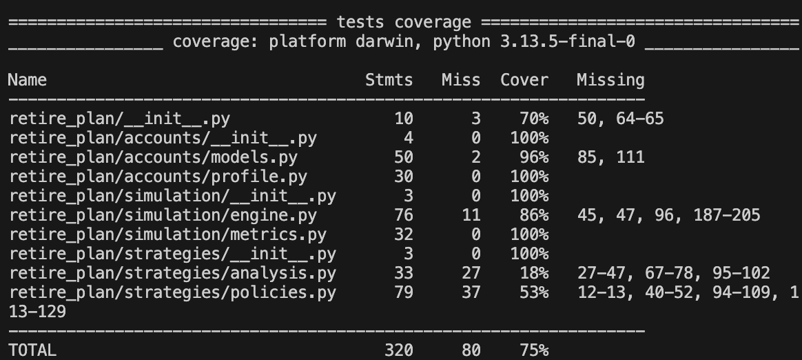

# 533-Project-Group-13

## 01 Package Structure

```text
retireplan/
├── src/
│   └── retireplan/
│       ├── __init__.py
│       ├── accounts/
│       │   ├── __init__.py
│       │   ├── accounts.py
│       │   ├── models.py
│       │   └── profile.py
│       ├── simulation/
│       │   ├── __init__.py
│       │   ├── engine.py
│       │   ├── metrics.py
│       │   └── README.md
│       └── strategies/
│           ├── __init__.py
│           ├── analysis.py
│           ├── policies.py
│           └── strategies.md
├── tests/
│   ├── __init__.py
│   ├── test_analysis.py
│   ├── test_engine.py
│   ├── test_metrics.py
│   ├── test_models.py
│   ├── test_policies.py
│   ├── test_profile.py
│   └── test_suite.py
├── demo_runner.py
├── pyproject.toml
├── README.md
├── LICENSE
├── .gitignore
└── requirements.txt

```

## 02 Testing & documentation responsibilities

In our group, the responsibilities are:

Accounts sub-package (retire_plan.accounts)

Implementation: Sage Yang

Documentation + tests: Rex (writes the user-facing documentation and unit tests for the accounts models and PersonProfile.)

Simulation sub-package (retire_plan.simulation)

Implementation: Hwimin

Documentation + tests: Sage Yang (writes the documentation and unittest-based test suite in tests/test_engine.py and tests/test_metrics.py.)

Strategies sub-package (retire_plan.strategies)

Implementation: Rex

Documentation + tests: Hwimin (writes the documentation and unit tests for withdrawal strategies and analysis helpers.)


## 03 Installation

The package is published on PyPI as **`retire-plan-group13`**.

```bash
pip install retire-plan-group13
```
After installation, you can import the package as:

```python
from retire_plan.accounts.profile import PersonProfile
from retire_plan.accounts.models import TaxDeferredAccount, TaxFreeAccount, TaxableAccount, TaxableAccount
from retire_plan.simulation.engine import Simulator
```

## 04 Quick example

```python
from retire_plan.accounts.models import TaxDeferredAccount, TaxFreeAccount, TaxableAccount
from retire_plan.accounts.profile import PersonProfile
from retire_plan.simulation.engine import Simulator

# Define three account types
acc_td = TaxDeferredAccount(name="RRSP", balance=100_000.0, annual_return=0.05)
acc_tf = TaxFreeAccount(name="TFSA", balance=50_000.0, annual_return=0.05)
acc_taxable = TaxableAccount(name="Taxable", balance=20_000.0, annual_return=0.03)

# Build a person profile
person = PersonProfile(
    name="Example",
    current_age=35,
    end_age=95,
    tax_deferred=acc_td,
    tax_free=acc_tf,
    taxable=acc_taxable,
    cpp_annual=12_000.0,
    oas_annual=8_000.0,
)

# Run a simple simulation with a chosen withdrawal strategy
sim = Simulator(person=person, strategy_name="taxable_first")
results = sim.run_full_lifecycle()

print(results.summary())
```

## 05 PyPI package link

The package is available on PyPI at:

https://pypi.org/project/retire-plan-group13/

## 06 Running tests and coverage locally

We use pytest and pytest-cov for testing and coverage. For this project, we ensured that the overall coverage is at least 75%, as required in the assignment.

```markdown

```

## 07 Demo video

A short demo video showing how to install and use the package,
the CI workflow, and the tests/coverage is included in this repository:

- [demo video](docs/demo.mp4)

On GitHub, clicking this link will either download the video or open it in the browser player.


